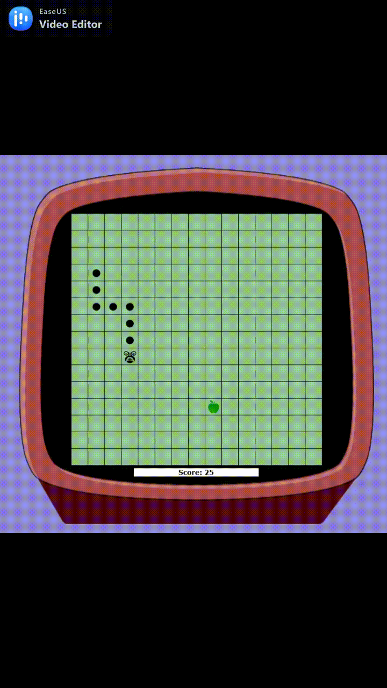

# Snake
Java replica of the game "Snake"

* apple +5 score
* wall is a barrier
* advancing in the game increases the speed (decreases turnDelay variable)
* win if snake reach lenght of 28 (125 score)

# Acknowledgments
desktop-game-engine.jar developed by codegym developers
